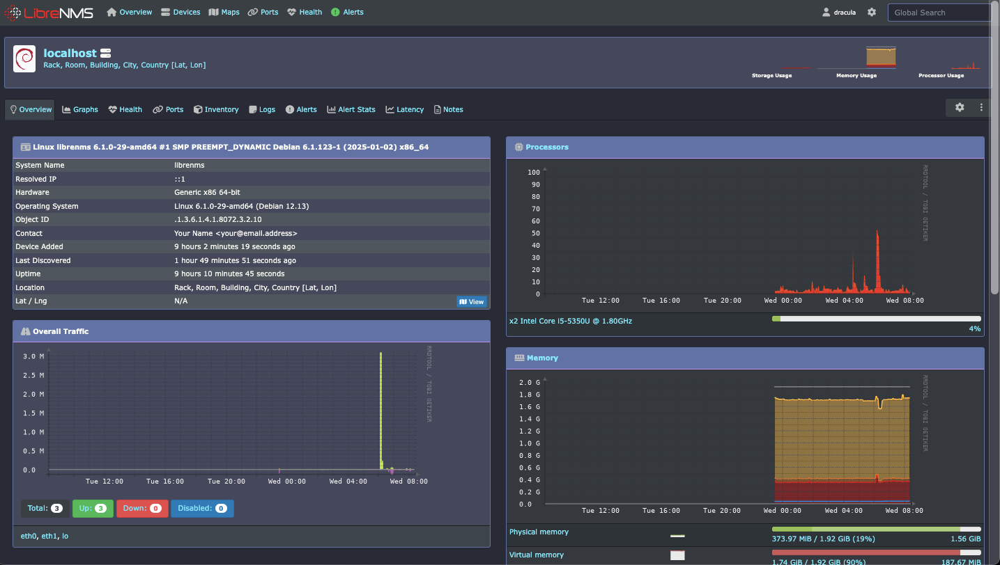

# Dracula for LibreNMS

> A dark and vibrant theme for [LibreNMS](https://www.librenms.org/) based on the [Dracula palette](https://draculatheme.com).



## Install

This theme is applied using the **Stylus** browser extension. This ensures the theme remains per-user and avoids legacy configurations.

### 1. Install Stylus Extension

- [Chrome / Edge / Brave](https://chrome.google.com/webstore/detail/stylus/clngdbkpkpeebahjckkjfobafhncgmne)
- [Firefox](https://addons.mozilla.org/en-US/firefox/addon/styl-us/)

### 2. Install and Configure

1. Click here: [Install directly with Stylus](https://raw.githubusercontent.com/santiag0z/dracula-librenms/main/dracula.user.css)
2. In the Stylus tab, replace `seu-ip-ou-dominio.com` with your server address.

---

## Configuration for Multiple Servers

### Method A: Specific Servers

If you manage specific instances, list them in the code using the example below:

```
`@-moz-document url-prefix("http://192.168.1.50"), url-prefix("https://nms.yourcompany.com") {`
```

### Method B: Any LibreNMS (Regexp)

To apply the theme to any URL containing the word "librenms":

```
`@-moz-document regexp("https?://.*librenms.*") {`
```

---

## Contributing

Is a specific widget, graph, or plugin missing the Dracula touch?

1. Open an **Issue** describing the element.
2. Or submit a **Pull Request** with your CSS improvements.

## License

[MIT License](./LICENSE)
